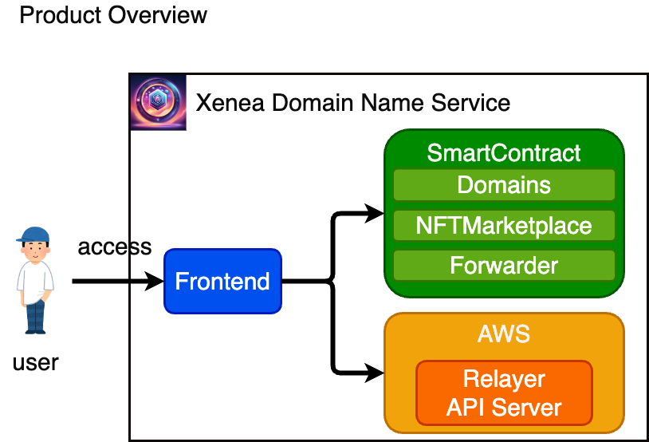
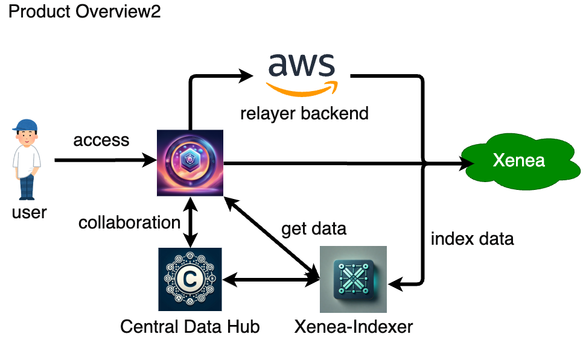

# 🏗 Xenea Domain Name Service (XDN)

[](https://github.com/mashharuki/CDN/actions/workflows/lint.yaml)

## WaveHack Global WebX DemoDay Pitch Slide

[Canva - WaveHack Global WebX DemoDay Pitch Slide](https://www.canva.com/design/DAGOKu_d4FI/itwaypRN70PJ0FRgfbaA6A/view?utm_content=DAGOKu_d4FI&utm_campaign=designshare&utm_medium=link&utm_source=editor)

## Slide

[Canva - Xenea Domain Name Service](https://www.canva.com/design/DAGEW_aT7tA/wpL6iocpw24o8T9BsPkV6Q/view?utm_content=DAGEW_aT7tA&utm_campaign=designshare&utm_medium=link&utm_source=editor)

## What it does

The CrossValueChain Domain Name Service simplifies the ethereal address, which is a long string of alphanumeric characters starting with "0x," to make it easier to remember and simpler to use as a string of characters(like ENS).

The CrossValueChain Domain is minted as NFT(ERC721).

## Product Overview





## Technologies I used

Next.js  
hardhat  
TypeScript  
openzeppelin  
ERC721  
yarn workspaces  
Scaffold-ETH 2  
ethers.js V6
CrossValueChain

## Update Points

### Wave1

SetUp Template project with Scaffold-ETH 2.

I have changed the settings to work with CrossValueChainTestnet & developed DomainName Contract(ERC721).

[DomainName Contract's code](https://github.com/mashharuki/CDN/blob/main/packages/hardhat/contracts/Domains.sol)

[DomainName Contract's test code](https://github.com/mashharuki/CDN/blob/main/packages/hardhat/test/Domains.test.ts)

I deployed DomainName Contract.

[0xD3095061512BCEA8E823063706BB9B15F75b187b](https://testnet.crossvaluescan.com/address/0xD3095061512BCEA8E823063706BB9B15F75b187b)

I registered new domain name in this transaction

[0x7924487669fa5af612ffd513f3f10ff6a572b92102bb9e0e0287470410c7f207](https://testnet.crossvaluescan.com/tx/0x7924487669fa5af612ffd513f3f10ff6a572b92102bb9e0e0287470410c7f207)

### Wave2

Update fronted

### Wave3

There are 3 update points.

- I Changed the contents of the Home Page to allow users to check and register domains from the Home Page.
- I Added filter function to the All Domains screen. You can now search only for domains that you own.
- I Added ability to update records on the All Domains screen. Allows you to set any record for any domain you own.

### Wave4

- SampleForwarder Contract

- Updated Domains Contract (NFT)

- DNS の所有に有効期限を付与(有効期限が過ぎたら自動的に burn)

  [Domains.sol に追加したロジック](https://github.com/mashharuki/CDN/blob/main/packages/hardhat/contracts/Domains.sol#L278-L334)

### Wave5

- 所有している DNS の一覧取得機能の追加

  [Domains.sol に追加したロジック](https://github.com/mashharuki/CDN/blob/main/packages/hardhat/contracts/Domains.sol#L269-L273)

- Wave4 及び Wave5 でロジックを追加したスマートコントラクトをテストネットにデプロイ

  ```bash
  ===================================== [START] =====================================
  reusing "SampleForwarder" at 0xacff3BF500e0E9F7734D39064B290873d80Fe749
  reusing "NFTMarketplace" at 0xd18d0D5c3C8f915865069Fe11b25228a737E9925
  NFTMarketplace Contract is deployed: 0xd18d0D5c3C8f915865069Fe11b25228a737E9925
  reusing "Domains" at 0xCa2d4842FB28190D0b68A5F620232685A2436CDe
  Domains Contract is deployed: 0xCa2d4842FB28190D0b68A5F620232685A2436CDe
  ===================================== [set Domains address START] =====================================
  setDomainsAddress txn hash: 0x27b15f6cd15a94571c26b4c38594bf53c311658c7fa44dd3b7422527ea768aa1
  ===================================== [set Domains address END] =====================================
  ===================================== [END] =====================================
  ```

- ドメイン発行時の引数の数が変更されたのでそれに伴ってフロントエンド側を更新

  [更新した箇所](https://github.com/mashharuki/CDN/blob/main/packages/nextjs/app/cdn/_components/ServiceCard.tsx#L162-L168)

- NFT マーケットプレイスの画面を追加しました。

  [追加したコード](https://github.com/mashharuki/CDN/blob/main/packages/nextjs/app/market/page.tsx)

- スマートコントラクトのテストコードを更新しました。(NFT マーケットプレイスコントラクトと追加したロジック用のテストコードを追加しました。)

  [Domains.test.ts](https://github.com/mashharuki/CDN/blob/main/packages/hardhat/test/Domains.test.ts)

- ドメイン発行時に有効期限を指定できるようにフロントエンドを改修しました。

  [更新した箇所](https://github.com/mashharuki/CDN/blob/main/packages/nextjs/app/cdn/_components/ServiceCard.tsx#L266-L280)

### Wave6

- OpenZeppelin のバージョンを`4.8.3`から`5.0.1`にバージョンアップさせました。

  [updates points](https://github.com/mashharuki/CDN/blob/main/packages/hardhat/contracts/Domains.sol)

- ドメインを発行した時に支払った NativeToken の半分を Relayer に送金するロジックを追加しました。

  [update points](https://github.com/mashharuki/CDN/blob/main/packages/hardhat/contracts/Domains.sol#L183-L185)

- ドメインの有効期限を画面から確認できるようにしました。

  [update points](https://github.com/mashharuki/CDN/blob/main/packages/nextjs/app/domains/_components/DomainCard.tsx#L73-L84)

- メタトランザクション機能をフロントエンド側に実装しました。

  [update points](https://github.com/mashharuki/CDN/blob/main/packages/nextjs/app/cdn/_components/ServiceCard.tsx#L120-L173)

  API のロジックも実装しました。

  [updates points](https://github.com/mashharuki/CDN/blob/main/packages/nextjs/app/api/requestRelayer/route.ts)

- リブランディングに伴う名称変更を行いました。

  [update points](https://github.com/mashharuki/CDN/blob/main/packages/nextjs/app/layout.tsx#L12-L13)

- Relayer を用意しました。

  [Relayer - 0xdec702931fBcaD4f4bB7C1C793E8e5Cdcf7c43A1](https://testnet.crossvaluescan.com/address/0xdec702931fBcaD4f4bB7C1C793E8e5Cdcf7c43A1)

- 上記ロジックに対応したコントラクトをデプロイしました。

  ```bash
  ===================================== [START] =====================================
  deploying "SampleForwarder" (tx: 0xf4803964ec863b99e37fc08849ae3ee6432b64f06e7db01b7778e55d0ea85b9d)...: deployed at 0x62CD2CBC855746c16FD16b4E5b34110e1549fc2e with 951238 gas
  deploying "NFTMarketplace" (tx: 0xcbb0b2041bce437247d62dc072e49e6173c29b2e78e78e390776ecf3490dcb91)...: deployed at 0x3c955E552Fd383435765313330301c23f014e0a6 with 983241 gas
  NFTMarketplace Contract is deployed: 0x3c955E552Fd383435765313330301c23f014e0a6
  deploying "Domains" (tx: 0x1b88ee8705d030acb658644bb671bd42df39a08a74403f5f956ce6222a5b06de)...: deployed at 0x9dbec436843B2f12BAf8A372CC210a0dA8c10281 with 4614653 gas
  Domains Contract is deployed: 0x9dbec436843B2f12BAf8A372CC210a0dA8c10281
  ===================================== [set Domains address START] =====================================
  setDomainsAddress txn hash: 0x59bd2091d065198a7055c89143a04efb73f1f771b4398aa5652271c901a93abe
  ===================================== [set Domains address END] =====================================
  ===================================== [END] =====================================
  ```

英語での更新内容説明文

- We have upgraded the version of OpenZeppelin from 4.8.3 to 5.0.1.
- We added a logic to send half of the NativeToken paid when issuing a domain to the Relayer.
  You can now check the domain expiration date on the screen.
- We implemented the meta-transaction feature on the front end.
- We performed a name change due to rebranding.
- We prepared a Relayer.
- We deployed contracts that correspond to the above logic.

### Wave7

- We have built backend logic on AWS to send transactions for meta-transactions from the relayer.

  Specifically, we are using the following services:

  - API Gateway
  - AWS Lambda
  - System Manager Parameters

  This resource is implemented using CDK and is set up to be automatically deployed and deleted.

- We have added settings for the XDN contract to the indexer for Xenea that Cardene has been developing.

  We plan to continue updating it in the upcoming Wave as well.

  [update points](https://github.com/cardene777/Xenea-Indexer-Template/pull/1)

### Wave8

- We added the NFTMarketPlace contract configuration to the Indexer.

  [https://github.com/cardene777/Xenea-Indexer-Template/pull/2](https://github.com/cardene777/Xenea-Indexer-Template/pull/2)

- We fixed a bug on the API side that occurred when minting an NFT.

  [Update Points](https://github.com/mashharuki/CDN/blob/main/packages/cdk/resources/lambda/lib/relayer.ts#L41-L53)

- We fixed a bug where the price was not automatically calculated when initially checking the domain's validity.

  [Update Points](https://github.com/mashharuki/CDN/blob/main/packages/nextjs/app/cdn/_components/ServiceCard.tsx#L68)

- We made it so you can immediately navigate to the block explorer after a domain is issued.

  [Update Points](https://github.com/mashharuki/CDN/blob/main/packages/nextjs/app/cdn/_components/ServiceCard.tsx#L273-L281)

- We enabled the front-end to call a function to check if a domain's expiration date has passed.

  [Update Points](https://github.com/mashharuki/CDN/blob/main/packages/nextjs/app/domains/_components/DomainCard.tsx#L148-L184)

### Wave9

- Central Data Hub との更なるコラボレーションのため ERC6551 向けの Indexer コンポーネントを追加開発しました。
- We developed the Indexer component for ERC6551 to enhance collaboration with the Central Data Hub.

  Cardene developed indexer

  Here is sample query

  ```gql
  query Edges($filter: RegisterFilter) {
    allRegisters(filter: $filter) {
      nodes {
        owner
        name
      }
    }
  }
  ```

- INTMAX Wallet SDK の機能を導入し新規ユーザーのオンボーディングをさらに簡単にしました。
- We integraded the features of the INTMAX Wallet SDK to make onboarding new users even easier.

### Wave10

- ドメイン登録時以外にもガスレスロジックを追加するようにする。
- We Will implement gasless logic not only during domain registration but also in other processes.

## What's next for future Wave

- I will try to connect the DomainName contract to the front end.
- I will try to improve UI/UX.

## how to work

- setup

  ```bash
  yarn setup --network kura
  ```

- test

  ```bash
  yarn test
  ```

- deploy to kura

  ```bash
  yarn deploy --network kura
  ```

- register new domain

  ```bash
  yarn hardhat:register --name cdn --amount 0.001 --year 1 --network kura
  ```

- gasless register new domain

  ```bash
  yarn hardhat:gaslessRegister --name cdn2 --year 1 --network kura
  ```

- check price of new domain name

  ```bash
  yarn hardhat:price --name test  --network kura
  ```

- set record data

  ```bash
  yarn hardhat:setRecord --name cdn --record sample --network kura
  ```

- withdraw from domains contract

  ```bash
  yarn hardhat:withdraw --network kura
  ```

- get tokenId's tokenURI

  ```bash
  yarn hardhat:getTokenURI --tokenid 0 --network kura
  ```

- check dmain name registered status

  ```bash
  yarn hardhat:checkRegistered --name cdn --network kura
  ```

- build Frontend

  ```bash
  yarn next:build
  ```

- start Frontend

  ```bash
  yarn start
  ```

- deploy CDK Stack

  ```bash
  yarn cdk deploy
  ```

- destroy CDK Stack

  ```bash
  yarn cdke destroy '*' --force
  ```

### 参考文献

1. [テストネット BlockExplorer](https://testnet.crossvaluescan.com/)
2. [Hardhat CrossValueChain Docs](https://docs.crossvalue.io/testnet/how-to-deploy-to-smart-contracts-hardhat)
3. [GitHub - ensdomains/ens-contracts](https://github.com/ensdomains/ens-contracts/tree/staging)
4. [ENS Dapp](https://app.ens.domains/unsupportedNetwork)
5. [ENS Docs](https://docs.ens.domains/registry/eth)
6. [daisyui Docs](https://daisyui.com/docs/themes)
7. [daisyui Next.js Example](https://stackblitz.com/edit/daisyui-nextjs?file=app%2Fpage.jsx)
8. [GitHub - Central-Data-Hub](https://github.com/cardene777/Central-Data-Hub)
9. [GitHub - Xenea-Indexer-Template](https://github.com/cardene777/Xenea-Indexer-Template)
10. [rindexer](https://rindexer.xyz/docs/introduction/installation)
11. [GitHub - rindexer](https://github.com/joshstevens19/rindexer)
